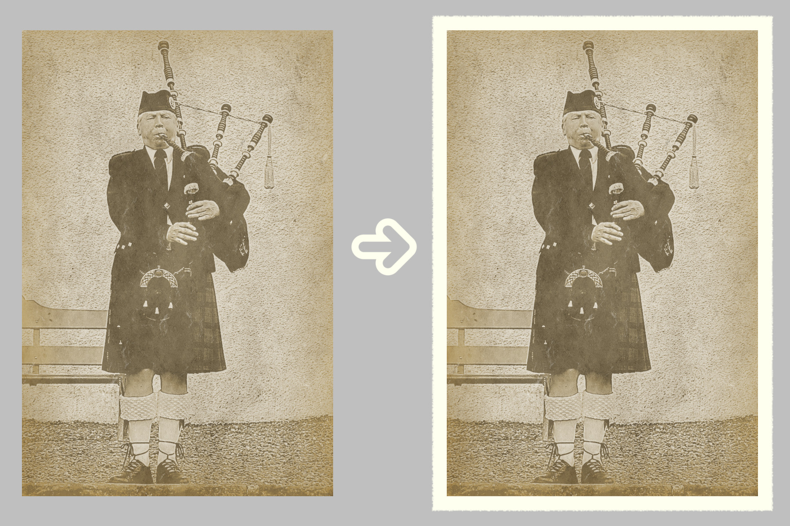

# deckle-edge-border
plug-in for Gimp (in Filters - Decor)

This plug-in creates a layer with an irregular deckle edge border around the original
image. It is possible to change border color and border width. Border width is a %
of the (shortest) image border.  This script uses the 'script_fu_fuzzy_border'-filter.
Best results are obtained with images > 1000 px.

